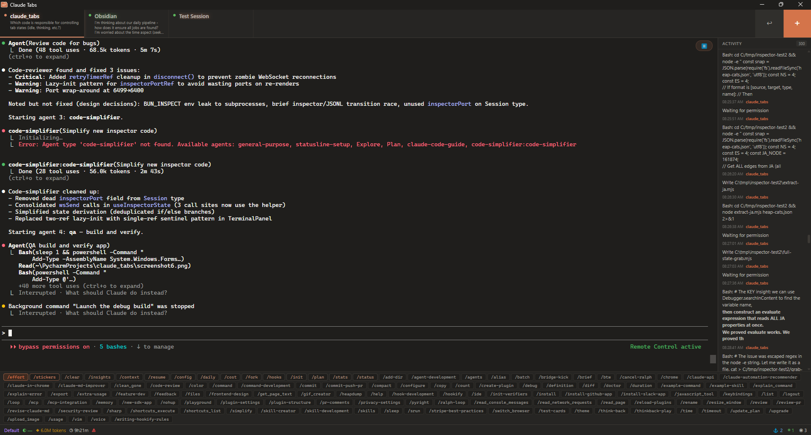

# Claude Tabs

A desktop app for managing multiple Claude Code CLI sessions in tabs, with slash command bar and session management.



## Features

- **Terminal tabs** — Run multiple Claude Code sessions side by side with fixed-width tabs, inline rename, and drag-to-reorder
- **Subagent display** — Live subagent status bar with elapsed time, token counts, and conversation inspector
- **Slash command bar** — All commands auto-discovered from your Claude Code installation, with queued execution
- **Session resume** — Resume past conversations with full CLI config persistence and first-message preview
- **Hooks manager** — View and configure Claude Code hooks across all scopes
- **CLI builder** — Visual launcher with every CLI option as clickable pills, live command preview

## Install

Download the latest `.exe` from [Releases](../../releases) or build from source:

```bash
npm install
npm run tauri build
```

The installer is at `src-tauri/target/release/bundle/nsis/`.

Or run the portable exe directly: `src-tauri/target/release/claude-tabs.exe`.

### Requirements

- Windows 10 (21H2+) or Windows 11
- [Claude Code CLI](https://claude.ai/code) installed and authenticated
- WebView2 runtime (pre-installed on Windows 11)

## Development

```bash
npm run tauri dev      # Dev mode with hot-reload
npx tsc --noEmit       # Type-check
npm test               # Unit tests
```

## Keyboard Shortcuts

| Shortcut | Action |
|----------|--------|
| `Ctrl+T` | New session |
| `Ctrl+R` | Resume past session |
| `Ctrl+W` | Close active session |
| `Ctrl+Tab` | Cycle tabs |
| `Ctrl+1-9` | Jump to tab N |
| `Ctrl+K` | Command palette |
| `Shift+Click tab` | Relaunch with new options |
| `Right-click tab` | Context menu (copy ID, etc.) |

## Architecture

```
React 19 + TypeScript (WebView2) ←→ Tauri v2 IPC ←→ Rust Backend ←→ ConPTY ←→ Claude CLI
```

Built with [Tauri](https://tauri.app), [xterm.js](https://xtermjs.org), and [Zustand](https://github.com/pmndrs/zustand).

## License

MIT
